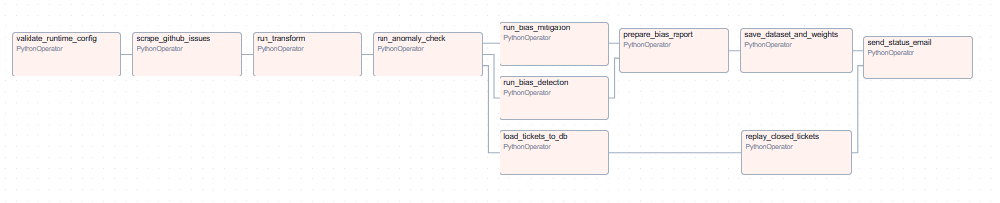
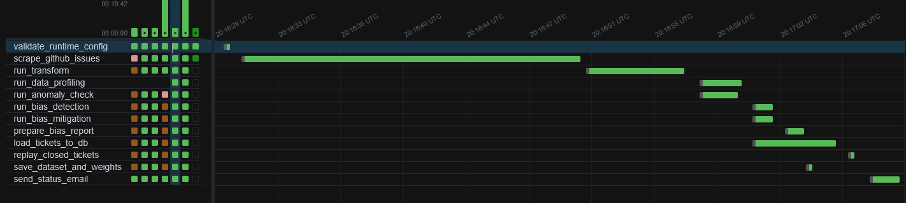
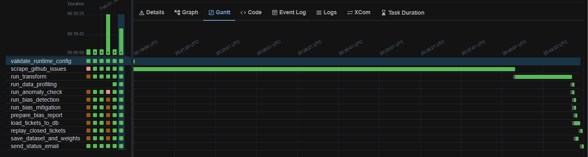
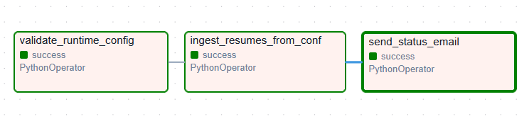
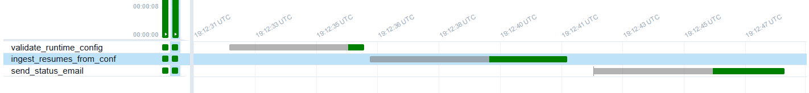

# Docker

This module defines docker images for running the application.

```
.
├── README.md
├── airflow/            # Airflow image and first-start configuration scripts
│   ├── Dockerfile      # Airflow container image with project configured
│   └── entrypoint.sh   # DB initialization script
├── base.Dockerfile     # Base docker image for any Python app in /apps
├── frontend.Dockerfile # Next.js production (standalone) image
└── inference.Dockerfile # Lightweight FastAPI inference stub for Cloud Run
```

## Cloud Run images (TicketForge apps)

From the **repo root**:

```bash
# FastAPI (uses base.Dockerfile Cloud Run stage, port 8080)
docker build -f docker/base.Dockerfile --target cloudrun-web-backend \
  --build-arg APP_NAME=web-backend -t ticketforge-api:local .

# Inference stub (port 8080)
docker build -f docker/inference.Dockerfile -t ticketforge-inference:local .

# Next.js (port 8080; set API URL used at build time for public env vars)
docker build -f docker/frontend.Dockerfile \
  --build-arg NEXT_PUBLIC_API_URL=https://your-api-url.run.app \
  -t ticketforge-web:local .
```

The same commands run in GitHub Actions (`docker-build-apps` job). Enable Terraform Cloud Run services with `enable_ticketforge_app_cloud_run` and image URIs in `terraform/terraform.tfvars.example`.

## Run Training Gates in Docker

Use the helper script from repo root:

```bash
scripts/ci/train_with_gates_docker.sh \
        --runid local-1 \
        --trigger workflow_dispatch \
        --commit-sha "$(git rev-parse HEAD)" \
        --snapshot-id dvc-latest \
        --source-uri dvc://data \
        --promote false
```

What it does:

- Builds an image from `docker/base.Dockerfile` with `APP_NAME=training`.
- Runs `python -m training.cmd.train_with_gates ...` inside the container.
- Mounts host `data/` to `/app/data` and `models/` to `/app/models`.
- Loads `.env` (if present) and passes common MLflow/gate environment variables.

## Airflow Local Run

Airflow runs from the **root** `docker-compose.yml` to avoid duplicate Postgres definitions.

### Prerequisites

- Docker Desktop / Docker Compose
- GitHub token (see [training setup](../apps/training/README.md))
- Gmail app password (see [training setup](../apps/training/README.md))
- `DATABASE_URL` in `.env` set to your Cloud SQL DSN (for local proxy this is usually `postgresql://...@host.docker.internal:5432/ticketforge`)
- `GCS_BUCKET_NAME` in `.env` for ticket ETL DAG publishing (format: `gs://<bucket>`)
- `GOOGLE_APPLICATION_CREDENTIALS` in `.env` pointing to a credentials file path inside the container (for example `/opt/ticket-forge/data/gcp-adc.json`)
- `GOOGLE_CLOUD_PROJECT` in `.env` set to your GCP project id
- Credentials in `.env` at repo root

### Setup

From repo root:

```bash
# working
chmod +777 ./data ./models
docker compose up -d postgres pgadmin airflow

# Or use the justfile command
just airflow-up
```

### One-Off Airflow Commands

Use one-off commands with:

```bash
docker compose run --rm airflow <airflow command>
```

The Airflow entrypoint now executes custom commands directly instead of starting
an extra scheduler/webserver process. This prevents stale sidecar containers
from competing for task execution.

**UIs:**
- Airflow: http://localhost:8080 (username: `airflow`, password: `airflow`)
- pgAdmin: http://localhost:5050 (see docker-compose.yml for credentials)

### DAGs

#### `ticket_etl` — Training Data Pipeline

**Purpose:** Complete ETL pipeline for training ML models. Ingests GitHub issues, performs quality checks, detects/mitigates bias, and loads data into Postgres.

**Schedule:** Monthly (`@monthly`)

**Runtime Parameters:**
- `limit_per_state` (optional, default: 200): Limit scraped issues per state (open/closed) per repo. Use `20` for quick testing.

**Outputs** (saved to `./data/github_issues-<timestamp>/`):
- `tickets_raw.json.gz` — Compressed raw scraped issues
- `tickets_transformed_improved.jsonl` — Transformed tickets (uncompressed)
- `tickets_transformed_improved.jsonl.gz` — Feature-engineered tickets with embeddings (compressed)
- `sample_weights.json` — Bias mitigation weights by demographic group
- `anomaly_report.txt` — Data quality analysis (missing values, outliers, schema)
- `bias_report.txt` — Fairness analysis with per-slice performance metrics
- `ticket_schema.json` — Auto-generated data schema (from profiling)

**Pipeline Steps:**
NOTE: Many steps run in parallel (see diagram below for execution flow):
1. `validate_runtime_config` → Parse parameters (default limit: 200), create timestamped output directory
2. `scrape_github_issues` → GraphQL API calls for issues across 3 repos × 3 states
3. `run_transform` → Feature engineering (embeddings, keywords, labels)
4. `run_anomaly_check` (parallel with 5) → Statistical checks, soft gate (warns if anomalies >20)
5. `run_data_profiling` (parallel with 4) → Generate data quality statistics
6. `run_bias_detection` (parallel with 7, after 4) → Analyze assignment fairness
7. `run_bias_mitigation` (parallel with 6, after 4) → Calculate sample weights
8. `prepare_bias_report` (after 6+7) → Combine bias detection + mitigation results
9. `save_dataset_and_weights` (after 8) → Persist compressed datasets, weights, reports
10. `load_tickets_to_db` (after 4, parallel to bias path) → Upsert tickets/assignments (with coldstart)
11. `replay_closed_tickets` (after 10) → Apply Experience Decay to profiles
12. `send_status_email` (after 9, 11, 5) → Email with anomaly + bias reports

**Database Side Effects:**
- Inserts/updates `tickets` table (with 384-dim pgvector embeddings)
- Inserts/updates `assignments` table
- Creates stub profiles in `users` table for new assignees
- Updates `profile_vector` via Experience Decay for closed tickets

**Trigger Examples:**

```bash
# Default run (200 per state per repo, ~600 tickets, ~3-5 min)
docker compose exec airflow airflow dags trigger ticket_etl

# Quick test (20 per state per repo, ~60 tickets, ~1-2 min)
docker compose exec airflow airflow dags trigger ticket_etl --conf '{"limit_per_state": 20}'

# Large dataset (10000 per state per repo, ~60,000 tickets, ~30-60 min)
docker compose exec airflow airflow dags trigger ticket_etl --conf '{"limit_per_state": 10000}'

# WARNING: Full scrape without limit takes 1-2 hours due to GitHub rate limits.
# Historical data beyond 1-2 years may have poor predictive power for recent tickets.
```

**Pipeline Visualization:**



**Execution Timeline:**

Here is an example gantt chart when scraping a small amount of total tickets (~1k tickets)


Here is an example gantt chart when scraping a large amount of total tickets (~20k)



---

#### `resume_etl` — Resume Ingestion Worker

**Purpose:** SQS-style worker processing resume upload requests from the API. Not a training pipeline - handles on-demand resume ingestion triggered by web backend - hence less data validation.

**Schedule:** None (triggered by API)

**Flow:** API uploads resume → DAG triggered → Extract text → Generate embeddings → Update engineer profile in DB. This isn't used to train an ML model and we control the schema the entire time, hence the lack of bias/anomaly detection.

**Inputs** (via `dag_run.conf`):
- `resumes` (array): List of resume payloads, each containing:
  - `filename`: Resume filename (e.g., `john_doe.pdf`)
  - `content_base64`: Base64-encoded PDF content
  - `github_username`: Engineer's GitHub username
  - `full_name` (optional): Engineer's full name

**Outputs**:
- No file outputs — directly updates Postgres

**Trigger Examples:**

```bash
# Limited test run (recommended for evaluation)
cd REPO_ROOT
docker compose exec airflow airflow dags trigger resume_etl --conf "$(cat data/sample_resumes/airflow-invocation.txt)"
```

**Pipeline Visualization:**



**Execution Timeline:**



---

## Pipeline Optimization

### Parallelization Strategy

Both DAGs are optimized for performance through strategic parallelization of independent tasks:

#### `ticket_etl` Parallel Execution

We optimized this pipeline to use parallel execution! The pipeline does two big things from a high level: create a dataset for training and import the tickets into our OLTP database (for our web app to use).

After transformation, the pipeline branches into multiple parallel paths:

```
Transform (Step 3)
        |
        ├──> [ Anomaly Check ] (Step 4)
        └──> [ Data Profiling ] (Step 5)
                |
        Anomaly Check ──┬──> [ Bias Detection  ] (Step 6)
                        ├──> [ Bias Mitigation ] (Step 7)
                        |         |
                        |    Prepare Report → Save Artifacts
                        |    (Steps 8-9: useful for training)
                        |
                        └──> [ Database Load ] → [ Replay Tickets ]
                             (Steps 10-11: useful for web-app)

        All paths converge → Send Email (Step 12)
```

**Key optimizations:**

1. **Anomaly + Profiling (parallel)**: Both analyze data quality independently right after transform
2. **Bias Detection + Mitigation (parallel)**: Run simultaneously after anomaly check, feeding into dataset artifacts
3. **Database Load (independent path)**: Starts immediately after anomaly check, runs parallel to bias analysis path
4. **Non-blocking gates**: Anomaly check uses soft gates (warns but doesn't fail), profiling failures don't block pipeline

**Impact:** Parallel execution saves ~10 minutes on 60k samples by allowing I/O-heavy operations to run concurrently (helpful when db in use by other processes). The gantt chart clearly shows the overlapping execution.

**Bottlenecks (cannot be parallelized):**
- **Web scraping**: GitHub API rate limits (~1 request/second). Would require multiple tokens or IP spoofing to bypass, which violates ToS
- **Embedding generation**: CPU/GPU intensive, consumes most resources on single machine. Will benefit from distributed workers when deployed to GCP

#### `resume_etl` Parallel Execution

This pipeline runs sequentially - why? Because the bottleneck is generating the embeddings. This is a CPU/GPU intensive task which will not benefit from additional concurrency since we run on one machine, as a single embedding process can consume most resources depending on whose machine is running it.

Thus to maximize compatibility of this pipeline on different laptops we left this with no parallelization. When we deploy to GCP later on or use workers on separate machines, we will update the pipeline.

### Resource Utilization

Parallelization leverages Airflow's built-in scheduler to distribute tasks across available workers. The Gantt charts above show the actual execution timelines, demonstrating how parallel tasks overlap and reduce total pipeline duration.

**Benefits:**
- Reduced wall-clock time for pipeline completion
- Faster feedback loops during development and testing
- Improved throughput for production workloads
