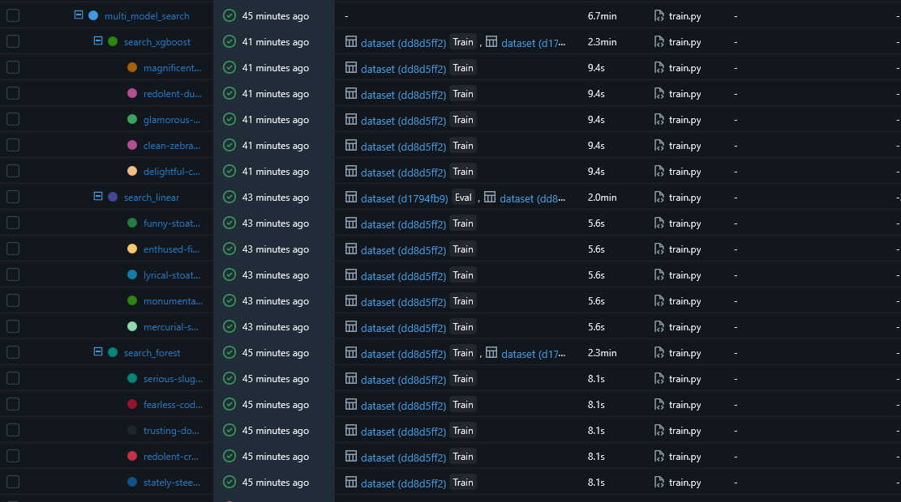
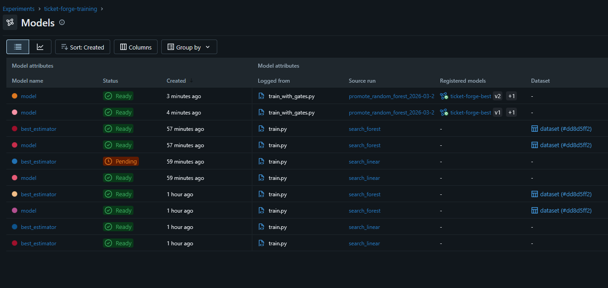
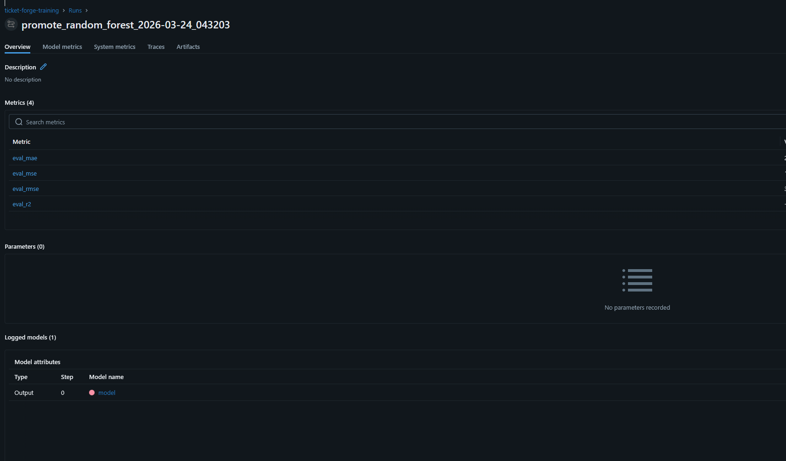
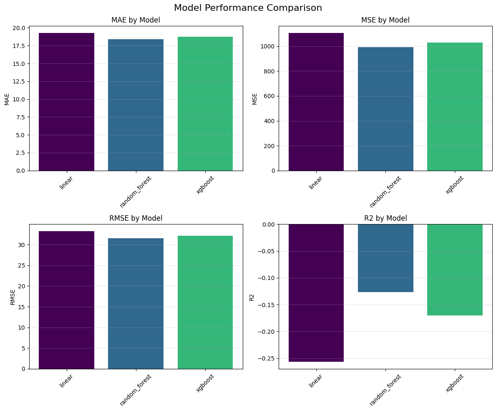
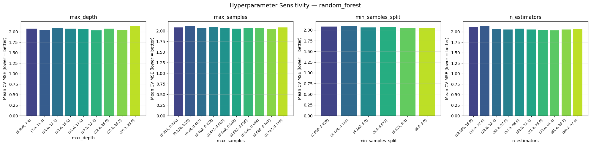
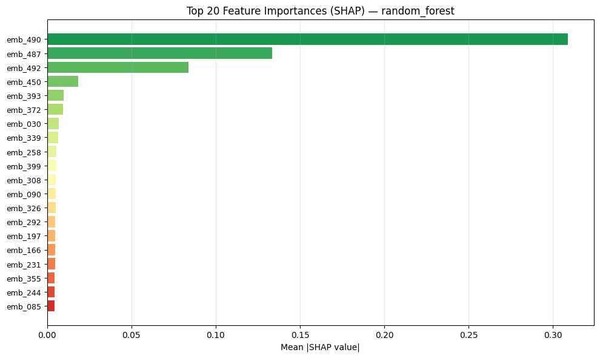
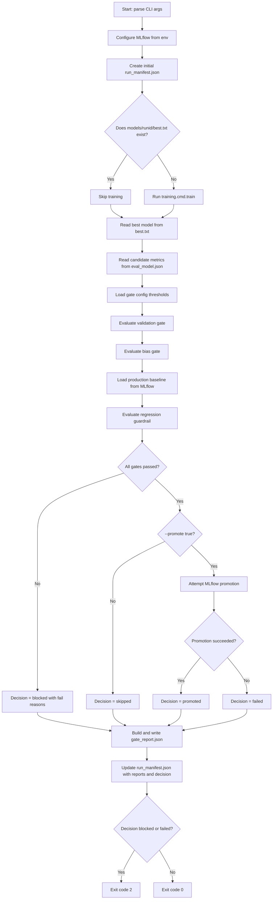
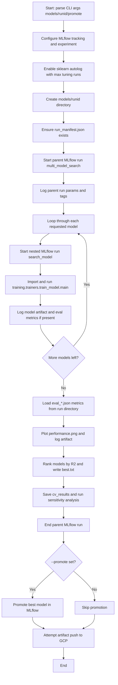

# ML Pipeline Requirements Coverage Report (Design-Decision Annotated)

High-level summary: `train.py` is the model-build harness (multi-model training,
hyperparameter search, best-model selection, and analysis artifacts), while
`train_with_gates.py` is the release-governance harness (validation, bias, and
regression gates plus optional promotion with a manifest [in-depth release information]). Data lineage is pinned via DVC
snapshots (`dvc pull`, `--snapshot-id`, `--source-uri`), experiment tracking and
registry state are stored in MLflow, local run artifacts are written under
`models/{run_id}/`, GitHub Actions uploads those run folders as CI artifacts,
and approved bundles are pushed to GCP Cloud Storage (`gs://.../models/{run_id}/`).

## Visual Evidence (Training + Registry + Analysis)

This section contains all available report images for quick review of training runs,
model comparison plots, sensitivity analysis, SHAP importance, and MLflow promotion state.

### MLflow Tracking and Promotion







### Model Analysis Plots








### 9.1 Setup

Use the main repo setup first, then training-specific setup.

- Root install/setup:
  - README.md (Installation)
- Training module setup:
  - apps/training/README.md
- Optional infra setup (for MLflow/GCP if you want to use your own infra):
  - terraform/README.md

From repo root:

```bash
just install-deps
```

Ensure data exists (required for non-dummy training):

```bash
dvc pull
```

Optional but common env vars:

```bash
export MLFLOW_TRACKING_URI="https://<mlflow-service-url>"
export MLFLOW_TRACKING_USERNAME="admin"
export MLFLOW_TRACKING_PASSWORD="<password>"
export MLFLOW_MAX_TUNING_RUNS="5"
# Optional dataset pin
export TICKET_FORGE_DATASET_ID="github_issues-YYYY-MM-DDTHHMMSSZ"
```

### 9.2 Run training only

```bash
just train --runid local-ml-001
```

Expected outputs:

- models/local-ml-001/best.txt
- models/local-ml-001/eval_{model}.json
- models/local-ml-001/performance.png
- all kinds of model specific plots and evaluations (metrics, sensitivity, etc.) also output in models/local-ml-001

### 9.3 Run full gated training/promotion decision

```bash
just train-with-gates \
  --runid local-gates-001 \
  --trigger workflow_dispatch \
  --commit-sha "$(git rev-parse HEAD)" \
  --snapshot-id dvc-latest \
  --source-uri dvc://data \
  --promote false
```

Expected outputs:

- models/local-gates-001/gate_report.json
- models/local-gates-001/run_manifest.json
- all kinds of model specific plots and evaluations (metrics, sensitivity, etc.) also output in models/local-ml-001
- same evaluation and 'best.txt' still output here
-
- Exit code 0 when gates pass or promotion is skipped successfully
- Exit code 2 when blocked/failed by gating logic

### 9.4 Run in Docker (reproducible mode)

```bash
scripts/ci/train_with_gates_docker.sh \
  --runid docker-gates-001 \
  --trigger workflow_dispatch \
  --promote false
```

What this does:

- Builds from docker/base.Dockerfile
- Runs training.cmd.train_with_gates in container
- Mounts host data/ and models/ into container paths used by training code
- Loads .env automatically when present
- You still need to set env vars locally for this to work if you want it to talk to prod mlflow

### CI/CD

You trigger the workflow by visiting the github page -> actions -> model CI/CD -> run !

Workflow entrypoint:

- .github/workflows/model-cicd.yml

Core runtime command used by CI is the same as local!

```bash
just train-with-gates --runid <github-run-id-attempt> ...
```

CI artifacts:

- model-artifacts-${{ github.run_id }} containing models/{run_id}/
- gate report included inside that run directory
- also modifies GCP storage bucket with best model and update ml-flow


## Scope and Evaluation Basis

This report maps each requirement to the current implementation in the training module, evaluated specifically through:

- apps/training/training/cmd/train_with_gates.py

For each requirement sub-part, this report documents:

- Requirement intent
- Status (Met / Partially Met / Not Met)
- What is implemented (with code locations)
- Design decision and justification (why this approach was chosen)
- train_with_gates.py inputs that affect it (if any)
- Observable outputs and where they appear
- Gap and improvement path (especially for Partially Met / Not Met)

---

## A) train_with_gates.py Contract (Input/Output Reference)
This is the main script which does all the training and acts
as a harness/orcestrator.

### Flowchart: train_with_gates.py Execution Steps



Notes:

- Training is idempotent for an existing run id that already has `best.txt`.
- Baseline comparison is skipped gracefully when production model metadata is unavailable.
- Promotion only occurs when all gates pass and `--promote true`.

### Summary: what train.py does

`train.py` is the core training harness. It parses model/run inputs, configures MLflow,
trains each requested model under nested MLflow runs, compares evaluation outputs,
writes the best model decision, generates analysis artifacts (performance plot,
cross-validation summaries, sensitivity and SHAP plots), optionally promotes the
best model in MLflow, and then attempts to push model artifacts to GCP storage.

By default, it trains model families that support sample weights (`forest`, `linear`,
`xgboost`). `svm` can be included explicitly via `--models`, and currently runs
the full-kernel variant (`svm_full`).

### Model families and estimators trained by train.py

- `forest` -> `RandomForestRegressor`
- `linear` -> `SGDRegressor`
- `svm` -> `SVR` (currently `svm_full`; an approximate pipeline exists but is disabled)
- `xgboost` -> `xgboost.XGBRegressor`

### Hyperparameter search in train.py

Each trainer uses `RandomizedSearchCV` with `PredefinedSplit` and
`scoring="neg_mean_squared_error"`, then refits the best configuration.

There is hyper-parameter tuning configured for:

- `forest`
- `linear`
- `svm_full`
- `xgboost`

Selection logic after all searches:

- Per-model: best trial is selected by `RandomizedSearchCV` under MSE-based scoring.
- Cross-model: `train.py` picks the overall best model by highest holdout `r2` from
  `eval_*.json`, and writes that decision to `best.txt`.

### Flowchart: train.py Execution Steps



Notes:

- Best model selection uses highest `r2` found in `eval_*.json` files.
- Sensitivity analysis failures are non-fatal and are logged, then execution continues.
- Artifact push to GCP is best-effort and does not stop training completion on failure.

### CLI Inputs

- --runid (required)
- --trigger
- --commit-sha
- --snapshot-id
- --source-uri
- --promote true|false

### Environment Inputs

#### MLflow controls

- MLFLOW_TRACKING_URI
- MLFLOW_TRACKING_URI_FROM_GCP
- MLFLOW_CLOUD_RUN_SERVICE
- MLFLOW_GCP_REGION
- MLFLOW_GCP_PROJECT_ID
- MLFLOW_EXPERIMENT_NAME
- MLFLOW_MAX_TUNING_RUNS

#### Dataset selector

- TICKET_FORGE_DATASET_ID (optional)

#### Gate controls

- MODEL_CICD_MIN_R2
- MODEL_CICD_MAX_MAE
- MODEL_CICD_MAX_BIAS_RELATIVE_GAP
- MODEL_CICD_MAX_REGRESSION_DEGRADATION
- MODEL_CICD_BIAS_SLICES

### Primary Outputs

In models/{runid}/:

- run_manifest.json
- best.txt
- eval_{model}.json
- {model}.pkl
- performance.png
- cv_results_{model}.json
- hyperparam_sensitivity_{model}.png
- shap_importance_{model}.png
- bias_{model}_{slice}.txt
- gate_report.json
- artifact_manifest.json (when push to GCS succeeds)

External outputs:

- MLflow experiment runs and registry versions
- GCS artifacts at gs://<bucket>/models/{runid}/...
- CI notification email (workflow-level)

The run_manifest.json has all the information about git sha, DVC data version used,
selected model, eval criteria and so-on.

---

## 1) Overview Requirement Coverage

### 1.0 End-to-end ML development lifecycle (overview)

- Requirement intent:
  - Demonstrate a complete model lifecycle: training, tuning, validation, bias checks, tracking, and gated promotion.
- Status:
  - Met
- What is implemented:
  - Orchestration entry points:
    - apps/training/training/cmd/train.py
    - apps/training/training/cmd/train_with_gates.py
  - CI/CD wiring:
    - .github/workflows/model-cicd.yml
- Design decision and justification:
  - Decision: Separate train.py (training/harness concerns) from train_with_gates.py (release governance concerns).
  - Justification: Keeps experimentation logic decoupled from deployment policy logic; easier local iteration and safer CI gate handling.
- train_with_gates.py inputs related:
  - All CLI arguments + gate/env controls.
- Observable outputs:
  - Full artifact set in models/{runid}/ and gate decision in gate_report.json.

---

## 2) Model Development and ML Code

### 2.1 Loading Data from the Data Pipeline

- Requirement intent:
  - Consume processed, versioned data from the upstream pipeline.
- Status:
  - Met
- What is implemented:
  - apps/training/training/dataset.py
    - find_latest_pipeline_output()
    - Dataset._load_records(), load_x(), load_y(), metadata loaders
  - Resolution strategy:
    - Use TICKET_FORGE_DATASET_ID override if provided
    - Else select latest valid github_issues-* directory containing tickets_transformed_improved.jsonl
    - Else fallback to legacy data/github_issues
- Design decision and justification:
  - Decision: Timestamped dataset directories + optional explicit override.
  - Justification: Supports deterministic reproducibility for CI (override) and low-friction local workflows (latest auto-discovery).
- train_with_gates.py inputs related:
  - --snapshot-id and --source-uri (lineage metadata)
  - TICKET_FORGE_DATASET_ID env var (actual dataset selector)
- Observable outputs:
  - Data lineage captured in models/{runid}/run_manifest.json -> data_snapshot
  - Failure mode is explicit FileNotFoundError when dataset is missing/invalid.

### 2.2 Training and Selecting the Best Model

- Requirement intent:
  - Train candidate models and select best-performing one.
- Status:
  - Met
- What is implemented:
  - apps/training/training/cmd/train.py
    - _train_models() executes forest, linear, svm, xgboost trainer modules
    - _load_metrics() and _save_best_model_info() rank by R2 and write best.txt
- Design decision and justification:
  - Decision: Multi-model candidate search in one run; best model selected using holdout R2.
  - Justification: Provides model family comparison with a single operational interface and auditable model choice.
- train_with_gates.py inputs related:
  - --runid
  - MLFLOW_MAX_TUNING_RUNS (affects trial logging scale)
- Observable outputs:
  - models/{runid}/{model}.pkl
  - models/{runid}/eval_{model}.json
  - models/{runid}/best.txt

### 2.3 Model Validation

- Requirement intent:
  - Validate trained model on hold-out data with task-appropriate metrics.
- Status:
  - Met
- What is implemented:
  - apps/training/training/trainers/utils/harness.py
    - get_test_accuracy() computes MAE, MSE, RMSE, R2 on test split
  - apps/training/training/analysis/validation_gate.py
    - evaluate_validation_gate() enforces thresholds
- Design decision and justification:
  - Decision: Use regression metrics MAE/RMSE/R2 rather than classification metrics.
  - Justification: Target is continuous completion time prediction, so regression metrics are the correct statistical contract.
- train_with_gates.py inputs related:
  - MODEL_CICD_MIN_R2
  - MODEL_CICD_MAX_MAE
- Observable outputs:
  - models/{runid}/eval_{model}.json
  - models/{runid}/gate_report.json -> validation_gate
  - models/{runid}/run_manifest.json -> validation_report

### 2.4 Model Bias Detection (slicing)

- Requirement intent:
  - Evaluate fairness/performance disparities across meaningful subgroups.
- Status:
  - Met
- What is implemented:
  - apps/training/training/bias/slicer.py
  - apps/training/training/bias/analyzer.py (Fairlearn MetricFrame)
  - apps/training/training/trainers/utils/harness.py::evaluate_bias()
    - currently enforced on repo and seniority slices
- Design decision and justification:
  - Decision: Use Fairlearn MetricFrame and report per-sensitive-feature bias artifacts.
  - Justification: Fairlearn provides robust group-wise metrics and disparity calculations appropriate for CI gate decisions.
- train_with_gates.py inputs related:
  - MODEL_CICD_MAX_BIAS_RELATIVE_GAP
  - MODEL_CICD_BIAS_SLICES (gate interpretation)
- Observable outputs:
  - models/{runid}/bias_{model}_repo.txt
  - models/{runid}/bias_{model}_seniority.txt
  - models/{runid}/gate_report.json -> bias_gate

### 2.5 Bias check code and mitigation strategy guidance

- Requirement intent:
  - Include executable bias checks and mitigation strategy/reporting.
- Status:
  - Met
- What is implemented:
  - Detection/reporting:
    - apps/training/training/bias/analyzer.py
    - apps/training/training/bias/report.py
    - apps/training/training/trainers/utils/harness.py::evaluate_bias()
  - Mitigation methods available:
    - apps/training/training/bias/mitigation.py
    - apps/training/training/analysis/run_bias_mitigation.py
- Design decision and justification:
  - Decision: Keep mitigation generation as an explicit, separable step (sample weights/resampling) rather than automatic in train_with_gates. This is kind of an in-between were our is aware of the bias when promoting (and gates) and also tries to mitigate with the sample weighting.
  - Justification: Prevents hidden data transformations in promotion pipeline and allows controlled fairness tuning.

- Observable outputs:
  - Bias reports and gate decisions in models/{runid}/
  - sample_weights.json when mitigation script is run explicitly.

### 2.6 Push model to artifact/model registry

- Requirement intent:
  - Version and publish accepted models/artifacts.
- Status:
  - Met
- What is implemented:
  - Registry promotion:
    - apps/training/training/analysis/mlflow_tracking.py::promote_best_model()
  - Artifact publishing:
    - apps/training/training/analysis/push_model_artifact.py
- Design decision and justification:
  - Decision: Register in MLflow Model Registry and also push a rich artifact bundle to GCS.
  - Justification: Registry supports release governance; GCS bundle supports reproducibility, audit, and downstream consumption.
- train_with_gates.py inputs related:
  - --promote true|false
  - MLflow/GCP auth env variables
- Observable outputs:
  - MLflow model version transition to Production (when eligible)
  - models/{runid}/artifact_manifest.json and GCS URIs

---

## 3) Hyperparameter Tuning

### 3.1 Tuning implementation and documentation of search process

- Requirement intent:
  - Optimize model configuration and preserve evidence of search behavior.
- Status:
  - Met
- What is implemented:
  - RandomizedSearchCV in trainer pipelines
  - cv_results_{model}.json persisted by harness
  - MLflow nested trial logging in analysis/mlflow_tracking.py
- Design decision and justification:
  - Decision: Randomized search over full grid search.
  - Justification: Better compute efficiency for broad search spaces while preserving statistically useful exploration.
- train_with_gates.py inputs related:
  - MLFLOW_MAX_TUNING_RUNS
- Observable outputs:
  - models/{runid}/cv_results_{model}.json
  - MLflow trial-level parameter/metric history

---

## 4) Experiment Tracking and Results

### 4.1 Tracking runs, metrics, params, and model versions

- Requirement intent:
  - Maintain full experiment traceability and rationale for model selection.
- Status:
  - Met
- What is implemented:
  - MLflow configuration and autologging:
    - apps/training/training/analysis/mlflow_config.py
    - apps/training/training/cmd/train.py::_enable_autolog()
  - Structured parent/model/trial run logging:
    - apps/training/training/analysis/mlflow_tracking.py
- Design decision and justification:
  - Decision: Hierarchical run model (multi_model_search -> per-model -> per-trial).
  - Justification: Enables clear comparison at each decision layer without losing fine-grained trial provenance.
- train_with_gates.py inputs related:
  - MLflow endpoint/auth env vars
  - --runid
- Observable outputs:
  - MLflow UI run tree and metrics
  - models/{runid}/performance.png, best.txt, eval_{model}.json

### 4.2 Result visualizations and selection evidence

- Requirement intent:
  - Provide concrete visual evidence for model-selection decisions.
- Status:
  - Met
- What is implemented:
  - apps/training/training/cmd/train.py::_plot_metrics()
  - Sensitivity plots in run_sensitivity_analysis.py
- Design decision and justification:
  - Decision: Persist static image artifacts alongside metrics JSON.
  - Justification: Human-readable review artifacts are easier for grading/reporting and CI artifact retention.
- train_with_gates.py inputs related:
  - No direct plotting flags; generated as part of training flow.
- Observable outputs:
  - models/{runid}/performance.png
  - models/{runid}/hyperparam_sensitivity_{model}.png
  - models/{runid}/shap_importance_{model}.png

---

## 5) Model Sensitivity Analysis

### 5.1 Feature importance sensitivity

- Requirement intent:
  - Quantify impact of features on predictions.
- Status:
  - Met
- What is implemented:
  - SHAP-based plots in apps/training/training/analysis/run_sensitivity_analysis.py
- Design decision and justification:
  - Decision: Prefer TreeExplainer/LinearExplainer, fallback to KernelExplainer.
  - Justification: Balances explainability fidelity with practical runtime.
- train_with_gates.py inputs related:
  - None directly
- Observable outputs:
  - models/{runid}/shap_importance_{model}.png

### 5.2 Hyperparameter sensitivity

- Requirement intent:
  - Show how parameter shifts affect model outcomes.
- Status:
  - Met
- What is implemented:
  - plot_hyperparam_sensitivity() in run_sensitivity_analysis.py
- Design decision and justification:
  - Decision: Aggregate by parameter values (with quantile binning for continuous vars).
  - Justification: Produces interpretable charts from noisy trial-space data.
- train_with_gates.py inputs related:
  - MLFLOW_MAX_TUNING_RUNS (indirectly affects trial volume and plot granularity)
- Observable outputs:
  - models/{runid}/hyperparam_sensitivity_{model}.png

---

## 6) Detailed Bias Requirement Coverage

### 6.1 Perform slicing

- Requirement intent:
  - Evaluate behavior over meaningful subpopulations.
- Status:
  - Met
- What is implemented:
  - Data slicing primitives in apps/training/training/bias/slicer.py
  - Enforced model-time slices in harness for repo/seniority
- Design decision and justification:
  - Decision: Start with operationally meaningful engineering slices (repo, seniority).
  - Justification: These slices align with assignment context and have direct process relevance.
- train_with_gates.py inputs related:
  - MODEL_CICD_BIAS_SLICES (gate policy input)
- Observable outputs:
  - bias_{model}_repo.txt, bias_{model}_seniority.txt

### 6.2 Track metrics across slices

- Requirement intent:
  - Quantify disparities and identify underperforming groups.
- Status:
  - Met
- What is implemented:
  - MetricFrame group metrics and disparity calculations in bias/analyzer.py
- Design decision and justification:
  - Decision: Use relative gap thresholding rather than raw absolute-only values.
  - Justification: Relative gaps normalize across different baseline difficulty levels.
- train_with_gates.py inputs related:
  - MODEL_CICD_MAX_BIAS_RELATIVE_GAP
- Observable outputs:
  - gate_report.json -> bias_gate.disparities, fail_reasons

### 6.3 Bias mitigation execution

- Requirement intent:
  - Apply mitigation when bias is detected.
- Status:
  - Met
- What is implemented:
  - Mitigation methods exist (reweighting/resampling) and sample-weight paths are supported.
  - Mitigation is produced by the data pipeline's bias remediation steps as sample_weights.json in
    the data directory. This is read to determine the weights to apply to samples from each repo.
- Design decision and justification:
  - Decision: Keep mitigation explicit/manual rather than automatic retraining loops inside promotion gate.
  - Justification: Avoids hidden fairness/accuracy trade-off changes during deployment-critical runs.
- train_with_gates.py inputs related:
  - None directly for mitigation activation.
- Observable outputs:
  - sample_weights.json when mitigation script is run.
- Gap and improvement path:
  - Gap: No closed-loop “detect -> mitigate -> retrain -> re-gate” inside one CI run, depends on `existing data/<dataset_id>/sample_weights.json`
  - Potential Improvement: Add explicit CI stage with deterministic mitigation policy and one bounded retrain cycle.

### 6.4 Document bias mitigation and trade-offs

- Requirement intent:
  - Record what was changed, why, and resulting trade-offs.
- Status:
  - Met
- What is implemented:
  - Bias report text files and gate report reason codes provide structured evidence.
  - These can be used to understand how samples were weighted and what the result of this weighting was
- Design decision and justification:
  - Decision: Artifact-first reporting (text/json files per run) over narrative-only report generation.
  - Justification: Machine-readable artifacts integrate better with CI and post-run automation. Its hard for machines to explain _why_ bias exists, so this is good middle ground
- train_with_gates.py inputs related:
  - Gate threshold env vars shape policy strictness/trade-offs.
  - Training outputs bias reports to bias_{model}_{slice}.txt
- Observable outputs:
  - bias_{model}_{slice}.txt and gate_report.json
- Gap and improvement path:
  - Gap: No automatic consolidated narrative “trade-off memo” artifact per run. But, we still have these bias reports which are automatically made and used to validate the release (and if bias is too much) it acts as a failure reason (which is emailed to user)
  - Improvement: Generate a run-level mitigation_decision.md summarizing pre/post disparities and performance impact.

---

## 7) CI/CD Pipeline Automation for Model Development

### 7.1 CI/CD setup and trigger behavior

- Requirement intent:
  - Automatically execute training/validation pipeline on repository updates.
- Status:
  - Met
- What is implemented:
  - .github/workflows/model-cicd.yml triggers on push to main, schedule, workflow_dispatch.
- Design decision and justification:
  - Decision: Always train on push to main (current policy), plus scheduled health runs.
  - Justification: Guarantees latest code path is continuously validated and deployability is always tested.
- train_with_gates.py inputs related:
  - Workflow passes --runid, --trigger, --commit-sha, --snapshot-id, --source-uri, --promote.
- Observable outputs:
  - GitHub Actions logs and uploaded models/{runid}/ artifact.

### 7.2 Automated model validation gate

- Requirement intent:
  - Block bad models from promotion automatically.
- Status:
  - Met
- What is implemented:
  - validation_gate in train_with_gates.py
- Design decision and justification:
  - Decision: Gate on MAE/R2 thresholds before promotion decision.
  - Justification: Explicit objective thresholds enforce consistent quality policy.
- train_with_gates.py inputs related:
  - MODEL_CICD_MIN_R2, MODEL_CICD_MAX_MAE
- Observable outputs:
  - gate_report.json validation_gate and decision reasons
  - exit code 2 when blocked/failed

### 7.3 Automated bias gate

- Requirement intent:
  - Prevent promotion when subgroup disparity is unacceptable.
- Status:
  - Met
- What is implemented:
  - bias_gate evaluation in train_with_gates.py using bias report artifacts
- Design decision and justification:
  - Decision: Promotion depends on validation gate + bias gate + regression guardrail all passing.
  - Justification: Ensures fairness is a release criterion, not post-hoc monitoring only.
- train_with_gates.py inputs related:
  - MODEL_CICD_MAX_BIAS_RELATIVE_GAP, MODEL_CICD_BIAS_SLICES
- Observable outputs:
  - gate_report.json bias_gate and promotion_decision

### 7.4 Automated registry push/deployment handoff

- Requirement intent:
  - Promote only approved models and publish artifacts.
- Status:
  - Met
- What is implemented:
  - Controlled promotion in train_with_gates.py (when --promote true and gates pass)
  - Artifact publication via push_model_artifact.py
- Design decision and justification:
  - Decision: Gate-first promotion with explicit promotion decision object.
  - Justification: Enforces deterministic release behavior and auditable governance trail.
- train_with_gates.py inputs related:
  - --promote
  - MLflow and GCP auth/env configuration
- Observable outputs:
  - MLflow registered version transitions
  - artifact_manifest.json + GCS object paths

### 7.5 Notifications and alerts

- Requirement intent:
  - Signal outcomes and failures to operators.
- Status:
  - Met
- What is implemented:
  - Email notification job in .github/workflows/model-cicd.yml with gate summary payload.
- Design decision and justification:
  - Decision: Email body includes gate decision context and run URL.
  - Justification: Speeds triage by embedding actionable context directly in notification.
- train_with_gates.py inputs related:
  - Indirect: produces gate_report consumed by workflow notification step.
- Observable outputs:
  - Email notification with pass/fail summary and gate details.

### 7.6 Rollback mechanism

- Requirement intent:
  - Ensure degraded candidates do not replace stable production models.
- Status:
  - Met
- What is implemented:
  - Preventive rollback behavior:
    - regression guardrail blocks promotion for excessive degradation compared to existing model
    - baseline_retained semantics in run_manifest update
  - Safe transition strategy:
    - promote new version first, archive prior Production versions after success (using mlflow)
- Design decision and justification:
  - Decision: Prefer pre-promotion prevention over post-deployment reactive rollback.
  - Justification: Reduces production blast radius by avoiding bad deployment in the first place. We also aren't in the 'deploy' deliverable yet, so since we can't check service health after "promoting" (i.e. blue-green roll-out or canary), this is a good intermediate
- train_with_gates.py inputs related:
  - MODEL_CICD_MAX_REGRESSION_DEGRADATION
- Observable outputs:
  - gate_report.json and run_manifest.json decision trail
  - If gated, email will be sent with the reason
- Gap and improvement path:
  - Gap: No automated post-deployment rollback trigger based on live production telemetry.
  - Improvement: Add monitoring signal ingestion + automated registry stage reversion workflow. This will come in the next deliverable as we look to consider blue/green roll outs

---

## Consolidated Status Summary

### Fully Met

- Data loading from versioned pipeline outputs
- Multi-model training and best-model selection
- Holdout validation and threshold-based gating
- Bias detection with slicing and disparity checks
- Hyperparameter tuning and experiment tracking
- Sensitivity analysis (SHAP + hyperparameter plots)
- CI/CD training + validation + bias gates + notifications
- Registry promotion and artifact publication

### Partially Met (with explicit rationale)

- Bias mitigation loop automation in train_with_gates path
  - Rationale: currently kept explicit/manual to avoid hidden retraining side effects during promotion runs. We have automatic bias mitigation with the feature weighting and we have automatic 'remediation' by gating promotion on this
  - Recommended enhancement: we can explore more methods for mitigating bias (i.e. partial fit models, resampling, etc.)
- Post-deployment reactive rollback automation
  - Rationale: current design prioritizes preventive gating before production promotion
  - Recommended enhancement: telemetry-driven automatic rollback workflow using something like blue-green

### Not Met

- None for core pipeline requirements.

---

## 8) Additional Requirements Checklist

This section is a direct checklist for the additional requirements block.

### 8.1 Docker or RAG format

- [x] Implement the model development process in Docker format for reproducibility/portability.
- Status: Met (via Docker path).
- Evidence:
  - docker/base.Dockerfile
  - scripts/ci/train_with_gates_docker.sh
- Design decision:
  - Docker was chosen (instead of RAG) because we are not an LLM project (lol).

### 8.2 Code for loading data from data pipeline

- [x] Data pipeline outputs are loaded from versioned outputs.
- Status: Met.
- Evidence:
  - apps/training/training/dataset.py::find_latest_pipeline_output
- Design decision:
  - Prefer timestamped dataset discovery with optional explicit override.
  - Justification: Balances reproducibility (explicit ID) and usability (latest valid auto-discovery).

### 8.3 Code for training model and selecting best model

- [x] Multi-model training and best-model selection is implemented.
- Status: Met.
- Evidence:
  - apps/training/training/cmd/train.py::_train_models
  - apps/training/training/cmd/train.py::_save_best_model_info
- Design decision:
  - Train multiple model families and select by holdout R2.
  - Justification: Provides architecture comparison and an auditable, deterministic selection rule.

### 8.4 Code for model validation

- [x] Validation on holdout split with task-appropriate metrics is implemented.
- Status: Met.
- Evidence:
  - apps/training/training/trainers/utils/harness.py::get_test_accuracy
  - apps/training/training/analysis/validation_gate.py
- Design decision:
  - Use MAE/RMSE/R2 (regression metrics) instead of classification metrics.
  - Justification: Target variable is continuous completion time.

### 8.5 Code for bias checking

- [x] Bias checking via slicing, disparity metrics, and report generation is implemented.
- Status: Met.
- Evidence:
  - apps/training/training/bias/slicer.py
  - apps/training/training/bias/analyzer.py
  - apps/training/training/bias/report.py
  - apps/training/training/trainers/utils/harness.py::evaluate_bias
- Design decision:
  - Fairlearn MetricFrame + per-slice text report artifacts.
  - Justification: Produces both machine-checkable and human-readable fairness evidence.

### 8.6 Code for model selection after bias checking

- [x] Final promotion decision is made after validation + bias + regression guardrail evaluation.
- Status: Met.
- Evidence:
  - apps/training/training/cmd/train_with_gates.py (gates_passed conjunction and promotion_decision)
  - apps/training/training/analysis/bias_gate.py
  - apps/training/training/analysis/regression_guardrail.py
- Design decision:
  - Gate-then-promote policy (promotion only when all gates pass).
  - Justification: Prevents quality-only optimization from bypassing fairness or regression safety.

### 8.7 Code to push model to artifact/model registry on GCP

- [x] Registry promotion and GCP artifact push are implemented.
- Status: Met.
- Evidence:
  - apps/training/training/analysis/mlflow_tracking.py::promote_best_model
  - apps/training/training/analysis/push_model_artifact.py
- Design decision:
  - Dual publish strategy: MLflow registry + GCS artifact package.
  - Justification: Registry supports lifecycle/stage management; GCS supports reproducibility and downstream consumption.
